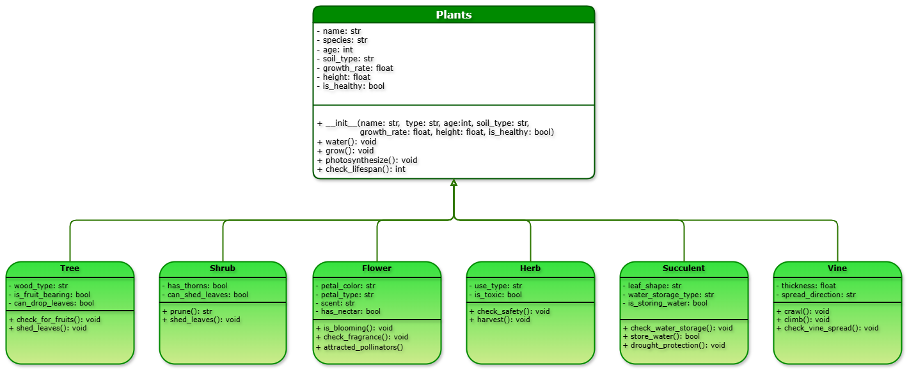

# **CS 121 - Advanced Computer Programming | Abstract Base Class**

Our team was assigned the abstract base class category: `Plant`!
- Project title
- Team members
- Short description of the system
- How to run the program
- Acknowledgement


# **The System**

## Class Diagram




## **🧬 Properties**

| **Type** | **Class**    | **Properties** |
|---------:|:------------:|:------------------------------------------------------------------------------|
| parent | **`Plant`**    | `name`, `species`, `age`, `soil_type`, `growth_rate`,`height`|
| child  | **`Tree`**     | `wood_type`, `is_fruit_bearing`, `can_drop_leaves`|
| child  | **`Shrub`**    | `has_thorns`, `can_shed_leaves`|
| child  | **`Flower`**   | `petal_type`, `petal_color`, `scent`, `has_nectar`|
| child  | **`Herb`**     | `use_type`, `is_toxic`|
| child  | **`Succulent`**| `leaf_shape`, `water_storage_type`, `is_storing_water`|
| child  | **`Vine`**     | `thickness`, `spread_direction`|


## **⚙️ Functions**

- **🪴 Plant**
    - _init_
    - water()
    - grow()
    - photosynthesize()
    - check_lifespan() 

- **🌳 Tree**
    - check_for_fruits()
    - shed_leaves() 

- **🪻 Shrub**
    - prune()
    - shed_leaves() 

- **🌷 Flower**
    - is_blooming()
    - check_fragrance()
    - attracted_pollinators() 

- **🌿 Herb**
    - check_safety()
    - harvest() 

- **🌱 Succulent**
    - check_water_storage()
    - store_water()
    - drought_protection() 

- **🪢 Vine**
    - crawl()
    - climb()
    - check_vine_spread()


# Running the Program


# Acknowledgment


## Test

To write <ins>something</ins> in the console, do this: ```print ("hello world")```
``` python
    def watering(self):
        pass

    def photosynthesize(self):
        pass

    def grow(self):
        pass

    def lifespan(self):
        pass
```
