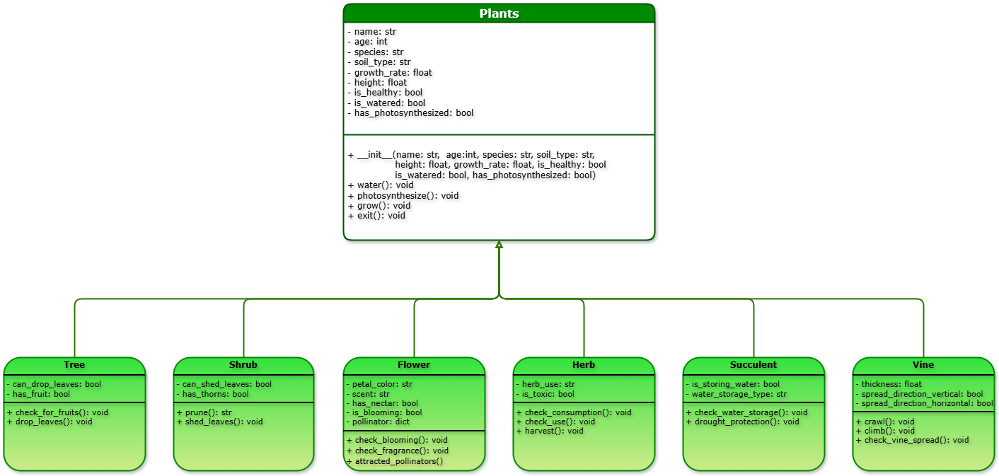

<h1 align="center">🌿 Plant Simulator 🍃</h1>
<p align="center"> Computer Science 121: Advanced Computer Programming | Abstract Base Class </p>

<p align="center">
    
</p>

‎ 
# **🔖 Project Overview**
<p align="justify">‎‎‎ ‎ ‎ ‎ A Plant Life Simulation System, built with Python and adhering to Object-Oriented Programming (OOP) principles, facilitates the simulation and interaction with various plant types. This includes trees, shrubs, flowers, and herbs, each endowed with distinct behaviors and attributes. The project's core objective is to provide an interactive platform for teaching and demonstrating fundamental OOP concepts: inheritance, abstraction, encapsulation, and polymorphism. 
</p>

‎ 
# **👥 Team**

👨‍💻 [Abrigo, John Nathaniel](https://github.com/Invxty)  
👨‍💻 [Angsioco, Edrian](https://github.com/edangsioco)  
👨‍💻 [Atienza, Dhanreigh](https://github.com/Dadanchiii)  
👩‍💻 [Calabia, Geanne Margaret](https://github.com/Ennage)

‎ 

<p align="center">
  
</p>

<h1 align="center">The System</h1>

<p align="justify">‎ ‎ ‎ ‎ The system is structured using a base abstract class called Plant and several child classes (Tree, Shrub, Flower, Herb, etc.), each implementing their own version of grow() methods. 
</p>

‎ 
## **📊 Class Diagram**

<p align="justify">‎‎ ‎ ‎ ‎ This diagram illustrates the relationship between the abstract base class Plant and its various subclasses. 
Each subclass represents a type of plant with its own unique attributes and behaviors.
</p>

 



‎ 
## **🧬 Properties**

<p align="justify">‎ ‎ ‎ ‎ Within this system, each plant comes to life with its own set of characteristics and behaviors, defined by a variety of properties. Every plant, regardless of its type, shares common traits: a name, species, the kind of soil it grows in, its age, height, and overall health. We also keep track of whether it's been watered or is actively photosynthesizing.
</p>

|  **Class**  | **Properties**                                                 |
| :---------: | :------------------------------------------------------------- |
|   `Plant`   | `name`, `age`, `species`, `soil_type`, `growth_rate`, `height`, `is_healthy`, `is_watered`, `has_photosynthesized` |
|    `Tree`   | `can_drop_leaves`, `has_fruit` |
|   `Shrub`   | `can_shed_leaves`, `has_thorns` |
|   `Flower`  | `petal_color`, `scent`, `has_nectar`, `is_blooming`, `pollinator` |
|    `Herb`   | `herb_use`, `is_toxic` |
| `Succulent` | `is_storing_water`, `water_storage_type` |
|    `Vine`   | `thickness`, `spread_direction_vertical`, `spread_direction_horizontal` |

‎ 

## **⚙️ Methods**

<p align="justify">‎ ‎ ‎ ‎ Below are the functions defined per class. These methods reflect typical behaviors or actions of each plant type.
</p>

### **🌾 `Plant` (Abstract Base Class)**
* __init__()
* water()
* photosynthesize()
* grow()
* exit()

### **🌲 `Tree`**
* check_for_fruits()
* drop_leaves()

### **🌳 `Shrub`**
* prune()
* shed_leaves()

### **🌷 `Flower`**
* check_blooming()
* check_fragrance()
* attracted_pollinators()

### **🌿 `Herb`**
* check_consumption()
* check_use
* harvest()

### **🌱 `Succulent`**
* check_water_storage()
* drought_protection()

### **🎋 `Vine`**
* crawl()
* climb()
* check_vine_spread()

‎ 
<p align="center">
  
</p>
‎ 
<h1 align="center"> Running the Program </h1>

1. **Set Up Your Python Environment**
   
   Make sure Python 3 is installed on your system. You can check by running:

   ```
   python --version
   ```

2. **Open the Project**
   
   Open the folder containing your `.py` file in your preferred IDE or code editor (e.g., VS Code, PyCharm, or IDLE).

3. **Navigate to the Main Script**
   
   Locate the main file of the project, typically named something like:

   ```
   plant_sim.py
   ```

4. **Run the Program**
   
   In your terminal or command prompt, run:

   ```
   python plant_sim.py
   ```

5. **Interact with the Program**
    
   Once the script is running, you should be greeted with this:
   ```
   | 🌼 Step into the Garden: Welcome to the Plant Simulator! 🌼
   |
   | Choose a plant:
   | 1. Tree      4. Herb         7. Exit
   | 2. Shrub     5. Succulent
   | 3. Flower    6. Vine
   |
   Enter the number of your choice (1-7):
   ```


‎ 
<h1 align="center"> Acknowledgment </h1>

‎ ‎ ‎ ‎ ‎We extend our heartfelt thanks to our instructor, [Ms. Fatima Marie](https://github.com/marieemoiselle), for fostering a collaborative and supportive learning environment that made this project both possible and enjoyable.

Special thanks to the following creators for the visual assets used in this markdown:

* 🌿 **Dancing Plant GIFs** by [@fulifuli on Tumblr](https://fulifuli.tumblr.com/)
* 🌱 **Plant Divider Graphics** by [@animatedglittergraphics-n-more on Tumblr](https://animatedglittergraphics-n-more.tumblr.com/)

Your creativity brought life and charm to our documentation!


‎ 
<p align="center">
  
</p>

<!-- nothing follows -->
