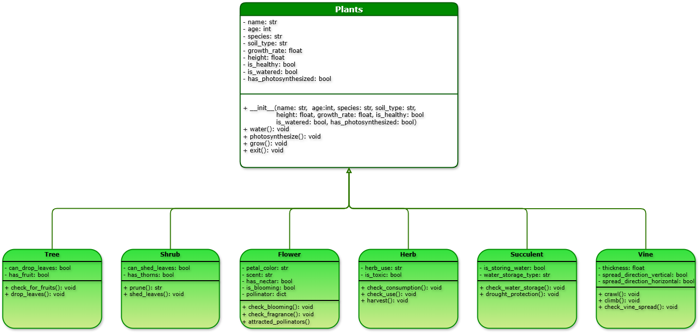

<h1 align="center">🍃 Plant Simulator 🌿</h1>
<p align="center"> Computer Science 121: Advanced Computer Programming | Abstract Base Class </p>

<p align="center">
    
</p>

‎
# **🔖 Project Overview**
Our team was assigned the abstract base class **`Plant`** as part of our exploration of inheritance and abstraction in Python.

‎
# **👥 Team:**
* 👨‍💻 Abrigo, John Nathaniel
* 👨‍💻 Angsioco, Edrian
* 👨‍💻 Atienza, Dhanreigh
* 👩‍💻 Calabia, Geanne Margaret

‎
# 🧩 **The System**

‎
## **📊 Class Diagram**
This diagram illustrates the relationship between the abstract base class `Plant` and its various subclasses. 
Each subclass represents a type of plant with its own unique attributes and behaviors.



‎
## 🧬 **Properties**

| **Type** |  **Class**  | **Properties**                                                 |
| :------: | :---------: | :------------------------------------------------------------- |
|  Parent  |   `Plant`   | `name`, `species`, `age`, `soil_type`, `growth_rate`, `height` |
|   Child  |    `Tree`   | `wood_type`, `is_fruit_bearing`, `can_drop_leaves`             |
|   Child  |   `Shrub`   | `has_thorns`, `can_shed_leaves`                                |
|   Child  |   `Flower`  | `petal_type`, `petal_color`, `scent`, `has_nectar`             |
|   Child  |    `Herb`   | `use_type`, `is_toxic`                                         |
|   Child  | `Succulent` | `leaf_shape`, `water_storage_type`, `is_storing_water`         |
|   Child  |    `Vine`   | `thickness`, `spread_direction`                                |

‎
## ⚙️ **Methods**

Below are the functions defined per class. 
These methods reflect typical behaviors or actions of each plant type.

### **🌾 `Plant` (Abstract Base Class)**
* __init__()
* water()
* grow()
* photosynthesize()
* check_lifespan()

### **🌲 `Tree`**
* check_for_fruits()
* shed_leaves()

### **🌳 `Shrub`**
* prune()
* shed_leaves()

### **🌷 `Flower`**
* is_blooming()
* check_fragrance()
* attracted_pollinators()

### **🌿 `Herb`**
* check_safety()
* harvest()

### **🌱 `Succulent`**
* check_water_storage()
* store_water()
* drought_protection()

### **🎋 `Vine`**
* crawl()
* climb()
* check_vine_spread()

‎
# 💻 Running the Program
To run the program, ensure your Python environment is set up, then execute the main script. 
Each plant type can be instantiated and interacted with using the provided methods.

‎
# 🙌 Acknowledgment
We would like to thank our instructor for the collaborative learning environment that helped make this project possible.

### GIFs
<div align="left">
  
  <a href="https://www.tumblr.com/undergroundpixel?source=share" target="_blank" style="text-decoration:none; color:inherit;">
    @undergroundpixel on Tumblr
  </a>
</div>


‎
#  Code Sample

To display output in the console, use:

```python
print("hello world")
```

Sample method (abstract format):

```python
def watering(self):
    pass

def photosynthesize(self):
    pass

def grow(self):
    pass

def lifespan(self):
    pass
```

